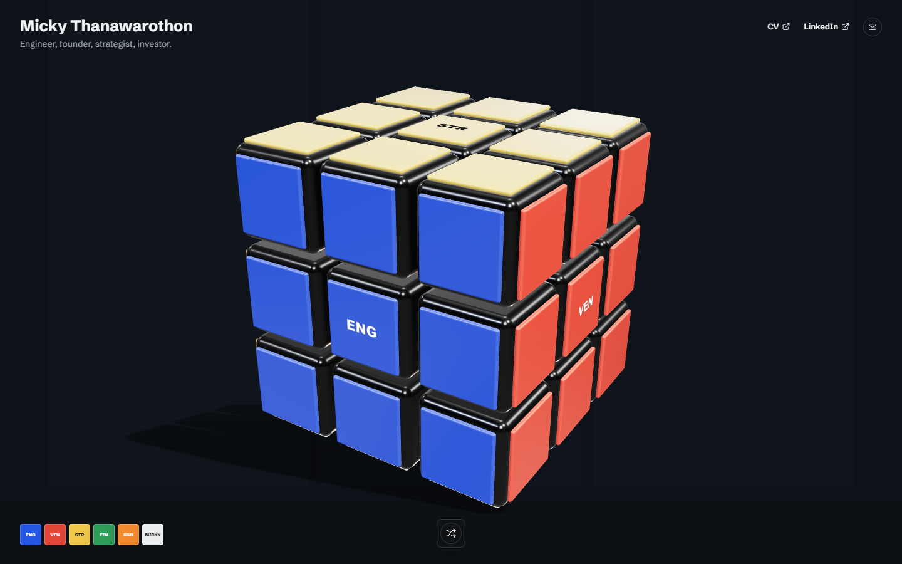

# mission-control

My portfolio — an interactive 3D cube where each face is a different side of
what I do: engineering, ventures, strategy, finance, research.

**Live → https://mission-control-one-beta-41.vercel.app**

I didn't want another grid of project cards. The whole site is a single 3D
object you spin and shuffle — each face opens into a different domain of my
work. Built to show range without a wall of text.

Built with Next.js, React Three Fiber (Three.js) and GSAP — one WebGL scene
driving the cube, its gestures, and the transitions.
